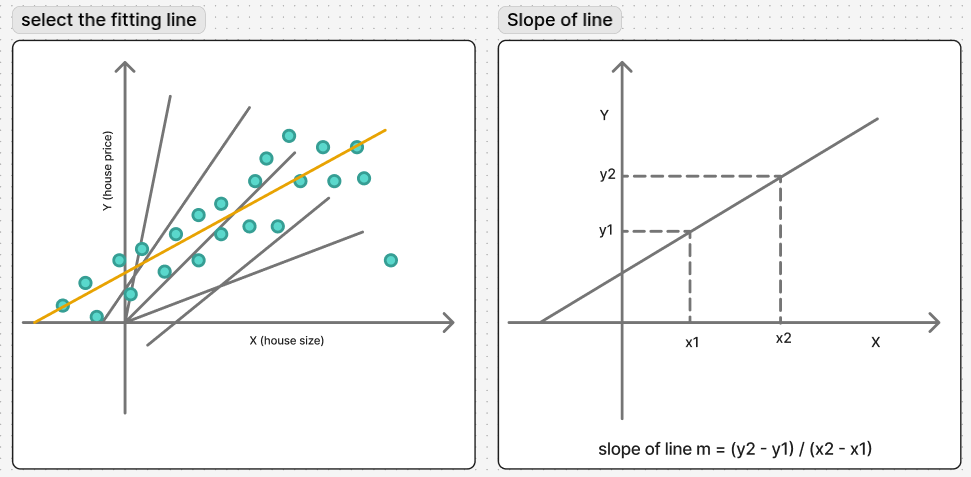
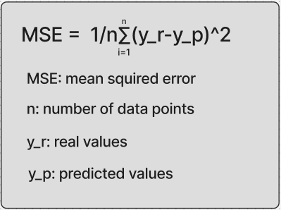
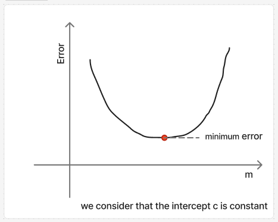

# Linear Regression
## what is linear regression?
Linear Regression is a [supervised learning](https://en.wikipedia.org/wiki/Supervised_learning) algorithm in machine learning, which is widely used for solving regression problems. Regression is a type of machine learning problems where the goal is to predict a continuous output variable based on one or more input variables.

### example of linear regression usage
##### the popular example of linear regression usage is house price prediction

<h5>assume that there is a linear relationship between size of house and his price.</h5>
<h5>the goal of linear regression is to find the best fitting line to describe the relationship between the input (house size) and the output (house price).</h5>

##### we have alotof lines. each line represented by m and c, m the slope defined by `m =  (y₂ - y₁) / (x₂ - x₁)` and c the intercept of the line with y axis
##### each line allows us to predict the price of each house, denoted by `x`, based on its size, denoted by `y`. by using the equation of the line `y = m*x + c`, but the predicted price may not be valid depends on the ability of this line to discribe the data.

##### In the upper figure there are different lines and the best line is the orange line. We choose this line by seeing the figure and comparing the lines, but the computer cannot do this, there are a set of complex operations that the computer performs to choose the best line.

<!--  -->

<h5>we define a error function or cost function that count the average value of error for each line, the error is the difference between the real house price y_r and the predicted house price y_p</h5>

<!-- <h5>allmost of the time we can't get a line that holds all points of the data set.</h5> -->

##### `error = (y_p - y_r)^2`
##### `y_p = m*x + c`
##### `error = ((m*x+c)-y_r)^2`

##### We use the exponent `^2` to avoid a negative value because sometimes the difference `y_p - y_r` is positive and sometimes it is negative, 

##### to count the average value of error we aplly this error function over all points of data, the exprission of average also named mean squared error  is shown in the image below

<h5>we compute the error in eash point and sume the errors. after that we divides the sume of errors over the number of points, finily we get the average value of error for our line</h5>
<h5>now we can take a set of lines and calculate the error (average of error) in each one of them, and select the line that have minimum error but this method not work, because we need to generate a huge number of lines and hupfuly there is one line that can fit the data</h5>

<h5>We know that there is one line that gives the minimum error, so we can use a graph of the error curve as a function of the slope m to make this clearer, The x-axis represents m, and the y-axis represents the error. We consider the intercept c as a constant to simplify the analysis.</h5>

<h5>We are dealing with a convex function, and we want to find its minimum using the derivative. From any point on the curve, we can move toward the minimum by following the gradient. To do this, we initialize the slope m with a random value, compute the derivative of the error function, and update m using the rule: 
new_m=m-(d(error)/dm*learning_rate), We repeat this process until the difference between successive values of the derivative becomes very small or close to zero. The learning rate is a parameter that controls how large each update step is.</h5>

